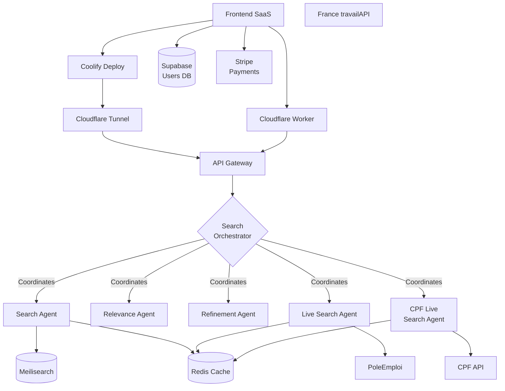
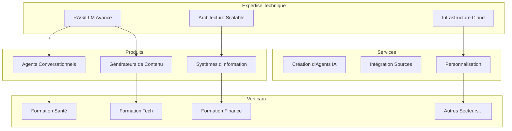
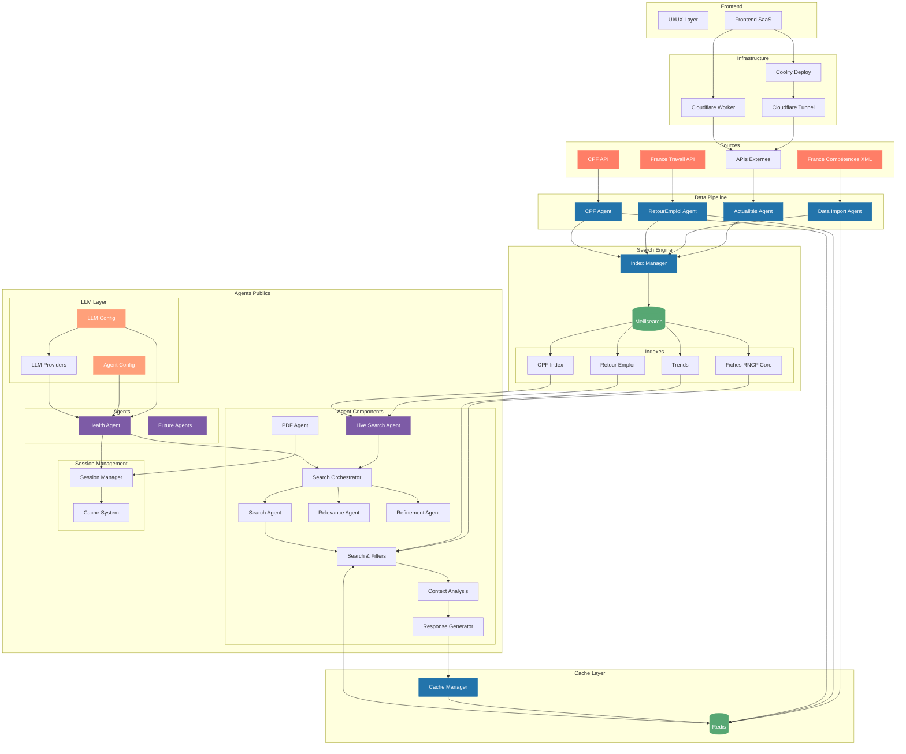

# passerelle.cc

## Architecture



## Composants

### Frontend
- **Supabase** : Gestion des utilisateurs et authentification
- **Stripe** : Gestion des paiements et abonnements

### Backend Core
- **API Gateway** : Point d'entrée unique pour les requêtes
- **Redis** : Cache pour les résultats de recherche
- **Meilisearch** : Moteur de recherche vectorielle

### Agents
- **SearchOrchestrator** : Coordonne les différents agents
- **SearchAgent** : Recherche dans Meilisearch
- **RelevanceAgent** : Évalue la pertinence via RAG
- **RefinementAgent** : Affine les recherches
- **LiveSearchAgent** : Enrichit via France travail
- **CPFLiveSearchAgent** : Enrichit via CPF

## 🎯 Moveto Studio

Moveto est un studio de solutions IA sectorielles qui combine expertise technique et connaissance métier pour créer des plateformes intelligentes spécialisées. Notre approche unique permet de déployer rapidement des solutions verticales complètes pour différents secteurs d'activité.

### Vision


### Solutions
1. **Licence Secteur**
   - Solution complète par vertical
   - Personnalisation possible
   - Support dédié
   - Déploiement cloud ou on-premise

2. **Services Pro**
   - Création d'agents personnalisés
   - Intégration de sources spécifiques
   - Formation et accompagnement
   - Conseil en stratégie IA

3. **API/SaaS**
   - IndexManager as a Service
   - Agent Factory API
   - Data Pipeline API
   - Analytics et monitoring

### Innovation
- Framework RAG++ propriétaire
- IndexManager avec support vectoriel natif
- Architecture multi-agents spécialisée
- Génération de contenu contextuelle
- Infrastructure cloud optimisée
- Système de cache intelligent

### Extensibilité 

Le système est conçu pour être facilement étendu à de nouveaux secteurs :

```python
# Exemple d'extension à un nouveau secteur
class SectorConfig:
    def __init__(self, name: str, sources: List[Source], agents: List[Agent]):
        self.name = name
        self.sources = sources  # Sources de données spécifiques au secteur
        self.agents = agents    # Agents spécialisés
        self.indexes = []       # Index Meilisearch dédiés

    async def initialize(self):
        # Configuration automatique des index
        for source in self.sources:
            index_config = await IndexManager.create_index_config(source)
            self.indexes.append(index_config)
        
        # Déploiement des agents
        for agent in self.agents:
            await agent.deploy()

# Utilisation
tech_sector = SectorConfig(
    name="Formation Tech",
    sources=[
        GitHubTrendsSource(),
        StackOverflowSource(),
        TechCertificationsSource()
    ],
    agents=[
        TechCareerAgent(),
        SkillsAnalysisAgent(),
        LearningPathAgent()
    ]
)
```

Cette architecture permet de :
- Ajouter de nouvelles sources de données
- Créer des agents spécialisés
- Configurer des index dédiés
- Personnaliser les workflows
- Adapter les modèles LLM

## 🚀 Architecture Globale



## 🚀 Table des Matières

1. [Moveto Studio](#-moveto-studio)
   - [Vision](#vision)
   - [Solutions](#solutions)
   - [Innovation](#innovation)

2. [Architecture Système](#-architecture-système)
   - [Vue d'Ensemble](#vue-densemble)
   - [Architecture RAG/CAG](#architecture-ragcag)
   - [Gestion des Index](#gestion-des-index)
   - [IndexManager comme Framework](#indexmanager-comme-framework)
   - [Workflow Détaillé](#workflow-détaillé)

3. [Technologies](#-technologies)
   - [Stack Technique](#stack-technique)
   - [Configuration LLM](#configuration-llm)
   - [Configuration des Agents](#configuration-des-agents)

4. [Fonctionnalités](#-fonctionnalités)
   - [Système Multi-Agents](#système-multi-agents)
   - [Recherche et Indexation](#recherche-et-indexation)
   - [Marketing Automation](#marketing-automation)

5. [Déploiement](#-déploiement)
   - [Installation](#installation)
   - [Configuration](#configuration)
   - [Tests et Validation](#tests-et-validation)

6. [Documentation Détaillée](#-documentation-détaillée)
   - [Agents Publics](#agents-publics)
   - [Autres Composants](#autres-composants)

## 🚀 Architecture Système

### Vue d'Ensemble 

Le système est composé de quatre composants principaux :

1. **IndexManager** (`index_manager.py`) 
   - Framework précurseur d'abstraction pour Meilisearch
   - Gestion unifiée des index vectoriels et textuels
   - Interface haut niveau pour les opérations CRUD
   - Système avancé de validation et transformation
   - Retry policy et gestion d'erreurs intelligente
   - Potentiel d'évolution vers un framework indépendant
   - Support natif du RAG et des embeddings
   - Architecture extensible pour d'autres moteurs de recherche

2. **DataImportAgent** (`data_import_agent.py`)
   - Import des fiches RNCP depuis XML
   - Stockage dans Redis pour le cache
   - Validation et transformation des données
   - Indexation dans Meilisearch via IndexManager
   - Gestion des mises à jour et des conflits

3. **ActualitesAgent** (`actualites_import_agent.py`)
   - Collecte des tendances via Google Trends
   - Analyse par secteur et catégorie
   - Indexation dans Meilisearch via IndexManager
   - Mise à jour automatique des tendances

4. **Agents Publics** (`agents_public/`)
   - Configuration LLM multi-providers (Anthropic, OpenAI, Ollama)
   - Configuration des agents par domaine
   - Recherche contextuelle avec RAG
   - Génération de réponses personnalisées
   - Cache intelligent des résultats

### Architecture RAG/CAG 

Le système utilise une architecture de génération augmentée :
```ascii
Query ──> Context Enrichment ──> Vector Search ──> LangChain ──────────────> Response
         (Agent Config)         (Meilisearch)     ├─> Claude (Anthropic)
                                                 ├─> GPT (OpenAI)
                                                 └─> Mistral (Ollama)
```

### Workflow Détaillé 

1. **Import des Données**
```python
# Import via DataImportAgent
async def import_rncp_data():
    xml_data = await fetch_xml_from_france_competences()
    validated_data = validate_rncp_schema(xml_data)
    
    for fiche in validated_data:
        # Cache dans Redis
        await redis_manager.set_fiche(fiche)
        
        # Transformation et enrichissement
        processed_fiche = transform_fiche(fiche)
        
        # Indexation dans Meilisearch
        await index_manager.index_documents(
            IndexType.FICHES_RNCP,
            [processed_fiche]
        )
```

2. **Gestion des Tendances**
```python
# Import via ActualitesAgent
async def update_trends():
    trends_data = await get_google_trends()
    
    # Transformation et catégorisation
    processed_trends = process_trends(trends_data)
    
    # Indexation dans Meilisearch
    await index_manager.index_documents(
        IndexType.TRENDS,
        processed_trends
    )
```

3. **Agent Public**
```python
# Configuration de l'agent
config = LLMConfig.create_internal(
    provider=LLMProvider.ANTHROPIC,
    model_name="claude-3-sonnet"
)

# Traitement d'une requête
async def process_query(query: str):
    # Recherche contextuelle
    context = await search_with_filters(query)
    
    # Génération de réponse
    response = await llm_chain.run(
        query=query,
        context=context,
        template=RESPONSE_TEMPLATE
    )
    
    return response
```

### Gestion des Index 

Configuration des index dans `IndexManager` :

```python
CONFIGS = {
    IndexType.FICHES_RNCP: {
        'primaryKey': 'code_rncp',
        'settings': {
            'filterableAttributes': [
                'niveau_europe',
                'codes_nsf',
                'codes_rome'
            ],
            'sortableAttributes': [
                'date_publication',
                'date_effet'
            ]
        }
    },
    IndexType.TRENDS: {
        'primaryKey': 'id',
        'settings': {
            'filterableAttributes': [
                'category',
                'subcategory',
                'interest_level',
                'trend'
            ],
            'sortableAttributes': [
                'date',
                'interest_level'
            ]
        }
    }
}
```

### IndexManager comme Framework 

L'`IndexManager` a été conçu comme un framework d'abstraction innovant pour Meilisearch, avec un potentiel d'évolution vers une solution indépendante :

```python
# Architecture extensible
class IndexManager:
    def __init__(self, config: IndexConfig):
        self.config = config
        self.vector_store = VectorStore()
        self.text_store = TextStore()

    async def add_documents(
        self,
        index_type: IndexType,
        documents: List[Dict],
        embeddings: Optional[List[Vector]] = None
    ):
        """Support unifié pour les documents textuels et vectoriels"""
        if embeddings:
            await self.vector_store.add(documents, embeddings)
        await self.text_store.add(documents)

    async def hybrid_search(
        self,
        index_type: IndexType,
        query: str,
        filters: Optional[Dict] = None
    ) -> List[Document]:
        """Recherche hybride (textuelle + vectorielle)"""
        vector_results = await self.vector_store.search(query)
        text_results = await self.text_store.search(query)
        return self.merge_results(vector_results, text_results)
```

#### Caractéristiques Innovantes

- **Abstraction Unifiée** : Interface unique pour les opérations textuelles et vectorielles
- **Validation Avancée** : Système de validation et transformation des données
- **Gestion d'Erreurs** : Retry policy intelligent et gestion des cas d'erreur
- **Support RAG Natif** : Intégration native avec les systèmes RAG
- **Extensibilité** : Architecture modulaire permettant l'ajout de nouveaux moteurs
- **Performance** : Optimisations automatiques des requêtes et du cache
- **Monitoring** : Métriques et logging avancés

## 🛠 Technologies

### Stack Technique 
- **FastAPI** : API REST
- **Redis** : Cache et stockage temporaire
- **Meilisearch** : Moteur de recherche
- **LangChain** : Framework LLM
- **Docker** : Conteneurisation

### Configuration LLM 

Configuration des modèles de langage :
```python
PROVIDER_INFO = {
    LLMProvider.ANTHROPIC: {
        'name': "Anthropic Claude",
        'models': ["claude-3-sonnet", "claude-3-opus"],
        'requires_api_key': True
    },
    LLMProvider.OPENAI: {
        'name': "OpenAI GPT",
        'models': ["gpt-4-turbo", "gpt-3.5-turbo"],
        'requires_api_key': True
    },
    LLMProvider.OLLAMA: {
        'name': "Ollama (Local)",
        'models': ["mistral", "llama2"],
        'requires_api_key': False
    }
}
```

### Configuration des Agents 

Configuration des agents publics :
```python
AGENT_CONFIG = {
    "health": {
        "llm": {
            "provider": LLMProvider.ANTHROPIC,
            "model": "claude-3-sonnet",
            "temperature": 0.7
        },
        "search": {
            "index": IndexType.FICHES_RNCP,
            "filters": {
                "codes_nsf": ["331"]  # Santé
            }
        },
        "cache": {
            "ttl": 3600,
            "prefix": "health_agent"
        }
    }
}
```

## 🎯 Fonctionnalités

### Système Multi-Agents 
- **Agents d'Import** : Gestion des données RNCP
- **Agent d'Actualités** : Suivi des tendances
- **Agents Publics** : Interface conversationnelle
- **Cache Intelligent** : Optimisation des performances

### Recherche et Indexation 
- Recherche full-text et filtres
- Indexation incrémentielle
- Cache Redis pour les performances
- Mise à jour automatique des tendances

### Marketing Automation 
- Analyse des tendances sectorielles
- Profiling automatique
- Qualification des leads

## 🚀 Déploiement

### Installation 

```bash
# Installation des dépendances
pip install -r requirements.txt

# Installation des agents publics
cd agents_public && pip install -e .

# Démarrage des services
docker-compose up -d
```

### Configuration 

Variables d'environnement requises :
```env
# Meilisearch
MEILI_URL=http://meilisearch:7700
MEILI_MASTER_KEY=your_key

# Redis
REDIS_URL=redis://redis:6379

# LLM
ANTHROPIC_API_KEY=your_key
OPENAI_API_KEY=your_key

# Sources
FRANCE_COMPETENCES_URL=your_url
TRENDS_UPDATE_CRON=0 */6 * * *
```

### Tests et Validation 

```bash
# Vérification des services
docker-compose ps

# Test des index
curl -H "Authorization: Bearer $MEILI_MASTER_KEY" \
     http://localhost:7700/indexes/trends/stats

# Test de l'agent santé
python -m pytest agents_public/tests/
```

## 📚 Documentation Détaillée

Pour plus de détails sur des composants spécifiques :

### Agents Publics 
[Documentation des Agents Publics](agents_public/README.md)
- Architecture des agents conversationnels
- Configuration LLM et providers
- Développement de nouveaux agents
- Tests et déploiement

### Autres Composants
- [Configuration LLM](agents_public/llm_config.py) : Configuration détaillée des modèles de langage
- [Agents Blog](agents_public/agents_blog/README.md) : Documentation des agents de génération de contenu
- [Agents Chat](agents_public/agents_chat/README.md) : Documentation des agents conversationnels

### Architecture des Agents Publics 

L'architecture des agents publics est composée de plusieurs couches spécialisées :

1. **Agent Components**
   - `SearchOrchestrator` : Coordonne la recherche et l'enrichissement des résultats
   - `SearchAgent` : Recherche dans les index Meilisearch
   - `RelevanceAgent` : Évalue la pertinence des résultats
   - `RefinementAgent` : Suggère des améliorations de recherche
   - `PDFAgent` : Génère des récapitulatifs PDF

2. **Session Management**
   - `SessionManager` : Gestion des sessions utilisateurs
   - Système de cache avec TTL
   - Conservation du contexte conversationnel

3. **LLM Layer**
   - Configuration multi-providers (Anthropic, OpenAI, Ollama)
   - Gestion des modèles par agent
   - Templates de prompts spécialisés

4. **Workflow de Traitement**
   ```python
   # Exemple de workflow
   async def process_query(query: str, session_id: str):
       # 1. Orchestration de la recherche
       context = await search_orchestrator.get_enriched_context(query)
       
       # 2. Gestion de session
       session = session_manager.get_session(session_id)
       session.update_context(context)
       
       # 3. Génération de réponse
       response = await generate_response(query, context)
       
       # 4. Suggestions contextuelles
       suggestions = get_contextual_suggestions(session)
       
       return {
           'message': response,
           'suggestions': suggestions
       }
   ```

## Configuration des Sources RNCP

Le système supporte deux sources pour les fiches RNCP :

### 1. Source Locale (par défaut)
Utilise un fichier XML local pour l'import des fiches.
```env
RNCP_SOURCE_ACTIVE=local
RNCP_LOCAL_PATH=data/rncp/fiches/export_fiches_RNCP_V4_1_2025-01-04.xml
```

### 2. Source URL
Télécharge automatiquement la dernière version depuis data.gouv.fr.
```env
RNCP_SOURCE_ACTIVE=url
RNCP_URL=https://www.data.gouv.fr/fr/datasets/r/46408b0e-02da-47ed-86f9-b5425a9a728e
```

Le système conserve les données dans Redis, donc l'import complet n'est effectué qu'une seule fois ou lors des mises à jour.

### Agents d'Index 

Le système inclut maintenant des agents spécialisés pour l'import et la gestion des données :

1. **RetourEmploi Agent** (`agents_index/pole_emploi/`)
   - Import des statistiques de retour à l'emploi
   - Intégration avec l'API France Travail
   - Analyse des taux d'accès à l'emploi
   - Enrichissement des données formations

2. **CPF Agent** (`agents_index/cpf/`)
   - Import des données de formation CPF
   - Analyse des coûts et financements
   - Statistiques d'engagement
   - Suivi des certifications

Ces agents s'intègrent avec :
- Le système de cache Redis
- L'IndexManager pour Meilisearch
- Le LiveSearchAgent pour les requêtes en temps réel
