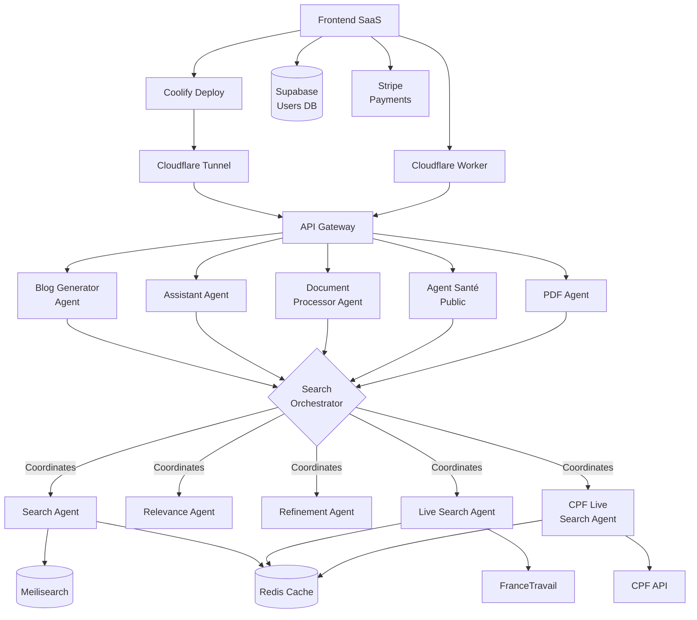
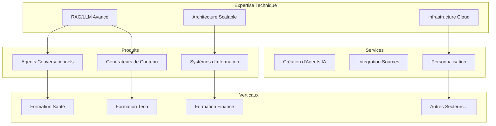
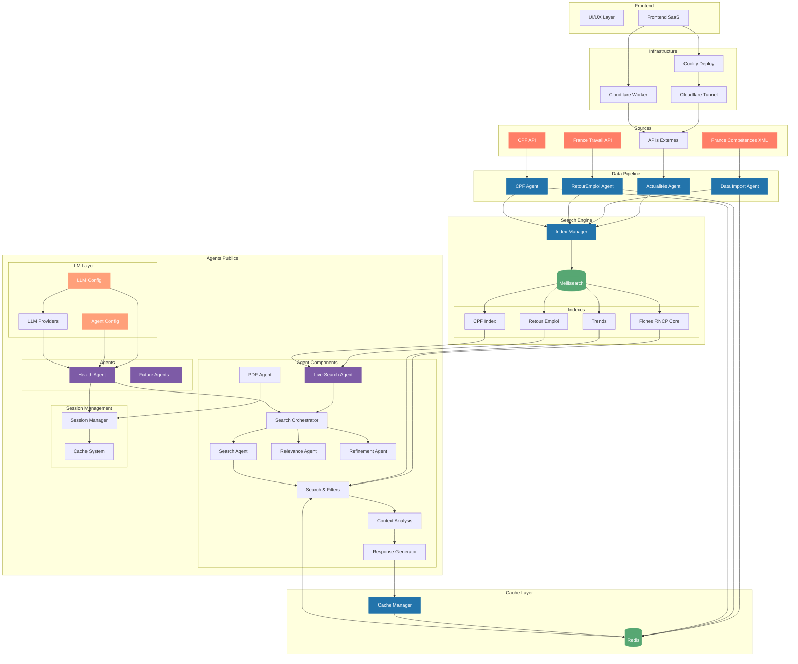

# passerelle.cc

## Architecture



## Composants

### Frontend
- **Supabase** : Gestion des utilisateurs et authentification
- **Stripe** : Gestion des paiements et abonnements

### Backend Core
- **API Gateway** : Point d'entrée unique pour les requêtes
- **Redis** : Cache pour les résultats de recherche
- **Meilisearch** : Moteur de recherche vectorielle

### Agents
- **SearchOrchestrator** : Coordonne les différents agents
- **SearchAgent** : Recherche dans Meilisearch
- **RelevanceAgent** : Évalue la pertinence via RAG
- **RefinementAgent** : Affine les recherches
- **LiveSearchAgent** : Enrichit via France travail
- **CPFLiveSearchAgent** : Enrichit via CPF

## 🎯 Moveto Studio

Moveto est un studio de solutions IA sectorielles qui combine expertise technique et connaissance métier pour créer des plateformes intelligentes spécialisées. Notre approche unique permet de déployer rapidement des solutions verticales complètes pour différents secteurs d'activité.

### Vision


### Solutions
1. **Licence Secteur**
   - Solution complète par vertical
   - Personnalisation possible
   - Support dédié
   - Déploiement cloud ou on-premise

2. **Services Pro**
   - Création d'agents personnalisés
   - Intégration de sources spécifiques
   - Formation et accompagnement
   - Conseil en stratégie IA

3. **API/SaaS**
   - IndexManager as a Service
   - Agent Factory API
   - Data Pipeline API
   - Analytics et monitoring

### Innovation
- Framework RAG++ propriétaire
- IndexManager avec support vectoriel natif
- Architecture multi-agents spécialisée
- Génération de contenu contextuelle
- Infrastructure cloud optimisée
- Système de cache intelligent

### Extensibilité 

Le système est conçu pour être facilement étendu à de nouveaux secteurs :

```python
# Exemple d'extension à un nouveau secteur
class SectorConfig:
    def __init__(self, name: str, sources: List[Source], agents: List[Agent]):
        self.name = name
        self.sources = sources  # Sources de données spécifiques au secteur
        self.agents = agents    # Agents spécialisés
        self.indexes = []       # Index Meilisearch dédiés

    async def initialize(self):
        # Configuration automatique des index
        for source in self.sources:
            index_config = await IndexManager.create_index_config(source)
            self.indexes.append(index_config)
        
        # Déploiement des agents
        for agent in self.agents:
            await agent.deploy()

# Utilisation
tech_sector = SectorConfig(
    name="Formation Tech",
    sources=[
        GitHubTrendsSource(),
        StackOverflowSource(),
        TechCertificationsSource()
    ],
    agents=[
        TechCareerAgent(),
        SkillsAnalysisAgent(),
        LearningPathAgent()
    ]
)
```

Cette architecture permet de :
- Ajouter de nouvelles sources de données
- Créer des agents spécialisés
- Configurer des index dédiés
- Personnaliser les workflows
- Adapter les modèles LLM

## 🚀 Architecture Globale


