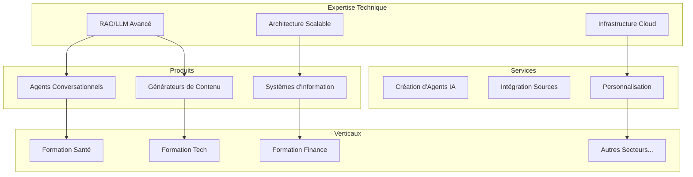
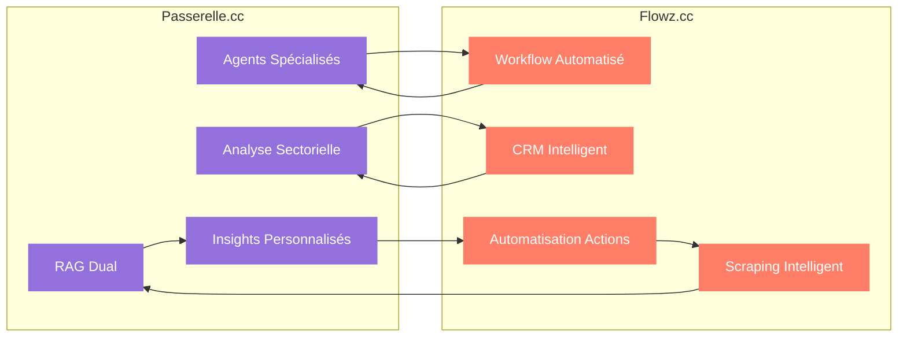
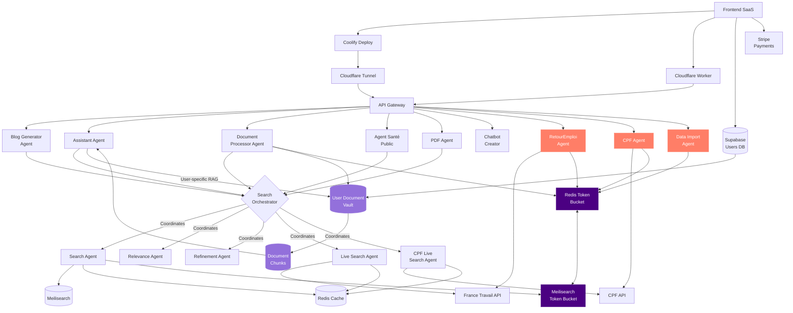
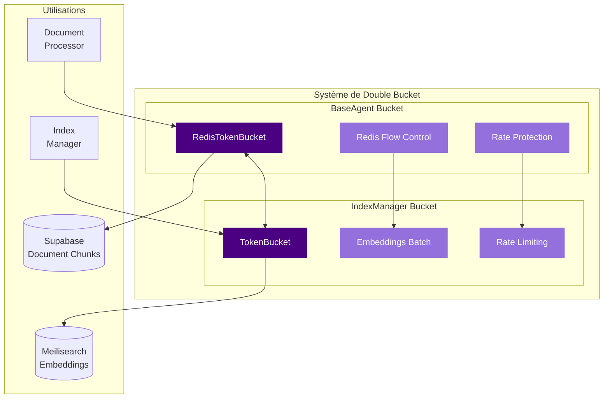
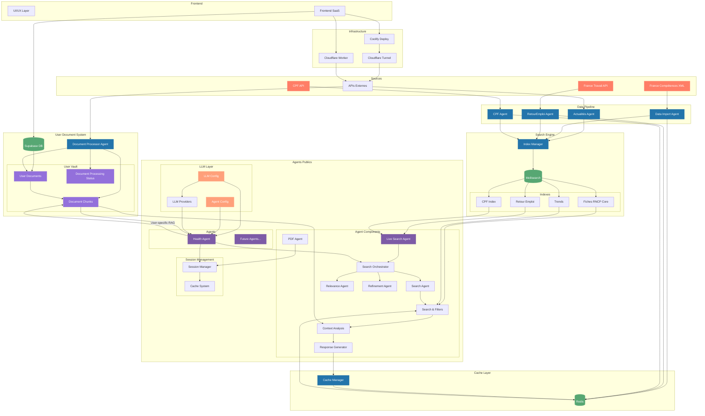

# Moveto Studio - Solutions IA Sectorielles

> Visitez [Flowz.cc](https://flowz.cc/) pour découvrir notre plateforme d'action et d'automatisation.

## Table des matières
- [Vision et Stratégie](#-vision-et-stratégie)
  - [Vision Technologique](#vision-technologique)
  - [Écosystème Moveto](#-écosystème-moveto--passerellecc--flowzcc)
  - [Vision Future : Agents IA Verticaux](#-vision-future--agents-ia-verticaux)
  - [Solutions](#solutions)
  - [Innovation](#innovation-)
  - [Extensibilité](#extensibilité)
- [Passerelle.cc - Analyses Stratégiques pour la Formation](#-passerellecc---analyses-stratégiques-pour-la-formation)
- [Plateforme Passerelle.cc](#-plateforme-passerellecc)
  - [Architecture](#architecture)
  - [Composants Principaux](#composants-principaux)
  - [Système RAG Dual](#-système-rag-dual)
  - [Système de Double Bucket](#-système-de-double-bucket-pour-les-embeddings)
- [Fonctionnalités de Passerelle.cc](#-fonctionnalités-de-passerellecc)
- [Architecture Technique Détaillée](#-architecture-technique-détaillée)
- [Partenariats](#-partenariats)

## 🎯 Vision et Stratégie

Je développe chez Moveto un studio de solutions IA sectorielles qui combine expertise technique et connaissance métier pour créer des plateformes intelligentes spécialisées. Mon approche unique permet de déployer rapidement des solutions verticales complètes pour différents secteurs d'activité.

### Vision Technologique


### 🔄 Écosystème Moveto : Passerelle.cc & Flowz.cc

Mon écosystème s'articule autour de deux plateformes complémentaires qui forment un cycle complet d'intelligence et d'action :



#### Passerelle.cc : La Plateforme d'Analyse
- **Compréhension contextuelle** des données sectorielles
- **Analyse personnalisée** des documents utilisateurs
- **Insights intelligents** via RAG dual
- **Agents spécialisés** par domaine d'expertise

#### Flowz.cc : La Plateforme d'Action
- **Scraping Intelligent** : Collecte automatisée de données avec IA
- **Workflow Intelligent** : Automatisation des processus métier
- **CRM Intelligent** : Gestion et qualification des leads B2B
- **Mise en action** des insights générés par Passerelle.cc

> Découvrez [Flowz.cc](https://flowz.cc/) - Ma solution d'automatisation nouvelle génération

#### Synergie et Intégration
Cette approche intégrée permet de créer un cycle vertueux où :
1. **Passerelle.cc analyse** les données sectorielles et documents utilisateurs
2. **Flowz.cc collecte** de nouvelles données pertinentes
3. **Passerelle.cc génère** des insights actionnables
4. **Flowz.cc automatise** les actions basées sur ces insights

### 🚀 Vision Future : Agents IA Verticaux

Selon une [étude de Y Combinator](https://www.ycombinator.com/library/Lt-vertical-ai-agents-could-be-10x-bigger-than-saas), les agents IA verticaux pourraient représenter un marché 10 fois plus important que le SaaS traditionnel. Je m'inscris pleinement dans cette vision avec une feuille de route ambitieuse :

#### 1. Transformation en Système Multi-Agents Autonome
- Agents spécialisés par tâche et secteur
- Orchestration automatique des workflows
- Réduction drastique de l'intervention humaine
- Prise de décision autonome basée sur les données

#### 2. Infrastructure B2A (Business-to-Agent)
- API publique pour l'intégration avec d'autres systèmes
- Système de plugins extensible
- Outils de monitoring et scaling des agents
- Marketplace d'agents spécialisés

#### 3. Automatisation Complète des Processus Métier
- Création automatique des dossiers de certification
- Mise à jour automatique des référentiels
- Validation automatique de la conformité
- Génération de rapports et analyses prédictives

#### 4. Expansion Verticale Multi-Sectorielle
Après le secteur de la formation professionnelle, je prévois d'étendre mon approche à d'autres verticaux :
- Santé et bien-être
- Finance et assurance
- Immobilier
- Ressources humaines
- Éducation supérieure

Cette vision s'appuie sur mon architecture modulaire et mon expertise en RAG, permettant une adaptation rapide à de nouveaux secteurs tout en maintenant une base technologique commune.

### Solutions
1. **Licence Secteur**
   - Solution complète par vertical
   - Personnalisation possible
   - Support dédié
   - Déploiement cloud ou on-premise

2. **Services Pro**
   - Création d'agents personnalisés
   - Intégration de sources spécifiques
   - Formation et accompagnement
   - Conseil en stratégie IA

3. **API/SaaS**
   - IndexManager as a Service
   - Agent Factory API
   - Data Pipeline API
   - Analytics et monitoring

### Innovation 
- Framework RAG++ propriétaire
- IndexManager avec support vectoriel natif
- Architecture multi-agents spécialisée
- Génération de contenu contextuelle
- Infrastructure cloud optimisée
- Système de cache intelligent

### Extensibilité 

Le système est conçu pour être facilement étendu à de nouveaux secteurs :

```python
# Exemple d'extension à un nouveau secteur
class SectorConfig:
    def __init__(self, name: str, sources: List[Source], agents: List[Agent]):
        self.name = name
        self.sources = sources  # Sources de données spécifiques au secteur
        self.agents = agents    # Agents spécialisés
        self.indexes = []       # Index Meilisearch dédiés

    async def initialize(self):
        # Configuration automatique des index
        for source in self.sources:
            index_config = await IndexManager.create_index_config(source)
            self.indexes.append(index_config)
        
        # Déploiement des agents
        for agent in self.agents:
            await agent.deploy()

# Utilisation
tech_sector = SectorConfig(
    name="Formation Tech",
    sources=[
        GitHubTrendsSource(),
        StackOverflowSource(),
        TechCertificationsSource()
    ],
    agents=[
        TechCareerAgent(),
        SkillsAnalysisAgent(),
        LearningPathAgent()
    ]
)
```

Cette architecture me permet de :
- Ajouter de nouvelles sources de données
- Créer des agents spécialisés
- Configurer des index dédiés
- Personnaliser les workflows
- Adapter les modèles LLM

## 📊 Passerelle.cc - Analyses Stratégiques pour la Formation

Passerelle.cc propose des outils d'analyse stratégique puissants pour optimiser votre activité de formation professionnelle :

<table width="100%">
  <tr>
    <td style="background: none; text-align: left;">
      
      <h3 style="text-align: left;">Analyse de Marché</h3>
      <h4 style="text-align: left;">Optimisez votre Positionnement</h4>
      <p>Accédez à des analyses détaillées de votre marché et prenez des décisions éclairées basées sur des données en temps réel.</p>
      <ul>
        <li><strong>Analyse Concurrentielle</strong> - Identifiez et analysez vos concurrents directs, leurs performances et leur positionnement.</li>
        <li><strong>Taux d'Emploi</strong> - Suivez les taux d'insertion et les salaires moyens par formation et par région.</li>
        <li><strong>Tendances Marché</strong> - Anticipez les évolutions du marché grâce à l'analyse des tendances en temps réel.</li>
      </ul>
    </td>
  </tr>
  <tr>
    <td style="background: none; text-align: left;">
      
      <h3 style="text-align: left;">Optimisation Catalogue</h3>
      <h4 style="text-align: left;">Optimisez votre Catalogue</h4>
      <p style="color: black;">Identifiez les opportunités et optimisez votre offre de formation grâce à nos analyses de données.</p>
      <ul style="color: black;">
        <li style="color: black;"><strong>Gaps d'Offre</strong> - Identifiez les opportunités de marché non exploitées dans votre secteur.</li>
        <li style="color: black;"><strong>Benchmark Prix</strong> - Comparez vos tarifs avec le marché et optimisez votre positionnement.</li>
        <li style="color: black;"><strong>Certification</strong> - Alignez vos formations avec les exigences RNCP et Qualiopi.</li>
      </ul>
    </td>
  </tr>
  <tr>
    <td style="background: none; text-align: left;">
      
      <h3 style="text-align: left;">Analyse Territoriale</h3>
      <h4 style="text-align: left;">Cartographiez vos Opportunités</h4>
      <p>Visualisez et analysez les opportunités de développement par territoire.</p>
      <ul>
        <li><strong>Zones Blanches</strong> - Identifiez les territoires sous-exploités pour votre développement.</li>
        <li><strong>Besoins Locaux</strong> - Analysez les besoins spécifiques de chaque région.</li>
        <li><strong>Concurrence</strong> - Cartographiez vos concurrents et leurs zones d'influence.</li>
      </ul>
    </td>
  </tr>
</table>

## 📊 Plateforme Passerelle.cc

Passerelle.cc est ma première implémentation verticale, spécialisée dans le secteur de la formation professionnelle.

### Architecture



### Composants Principaux

#### Frontend
- **Supabase** : Gestion des utilisateurs et authentification
- **Stripe** : Gestion des paiements et abonnements

#### Backend Core
- **API Gateway** : Point d'entrée unique pour les requêtes
- **Redis** : Cache pour les résultats de recherche
- **Meilisearch** : Moteur de recherche vectorielle
- **User Document Vault** : Stockage sécurisé des documents utilisateurs
- **Document Chunks** : Fragments de documents vectorisés pour le RAG utilisateur

#### Agents

##### Agents Publics (Interface Utilisateur)
- **AssistantAgent** : Agent principal d'interaction avec l'utilisateur, intègre le RAG dual
- **AgentSantePublic** : Spécialisé dans le domaine de la santé publique
- **PDFAgent** : Traitement et analyse des documents PDF
- **BlogGeneratorAgent** : Génération de contenu pour les blogs

##### Agents d'Orchestration
- **SearchOrchestrator** : Coordonne les différents agents de recherche
- **ChatbotCreator** : Création et configuration de nouveaux agents conversationnels

##### Agents de Recherche et Analyse
- **SearchAgent** : Recherche dans les index Meilisearch
- **RelevanceAgent** : Évalue la pertinence des résultats via RAG
- **RefinementAgent** : Affine les recherches pour améliorer la précision
- **LiveSearchAgent** : Enrichit les résultats via l'API France Travail
- **CPFLiveSearchAgent** : Enrichit les résultats via l'API CPF

##### Agents de Traitement de Documents
- **DocumentProcessor** : Traite et indexe les documents utilisateurs pour le RAG personnalisé
- **DocumentProcessorService** : Service de traitement asynchrone des documents

##### Agents d'Indexation
- **RetourEmploiAgent** : Indexation des données de retour à l'emploi
- **CPFAgent** : Indexation des formations CPF
- **DataImportAgent** : Importation et indexation des données sectorielles

### 🔄 Système RAG Dual

Mon système Passerelle.cc intègre une architecture RAG (Retrieval Augmented Generation) à deux niveaux :

#### 1. RAG Global (Sectoriel)
- Basé sur les données sectorielles indexées dans Meilisearch
- Alimenté par les agents d'import (Data Import, Actualités, RetourEmploi, CPF)
- Fournit une base de connaissances commune à tous les utilisateurs
- Optimisé pour les requêtes générales sur le secteur de la formation

#### 2. RAG Utilisateur (Personnalisé)
- Basé sur les documents personnels stockés dans le Vault utilisateur
- Géré par le Document Processor Agent
- Stockage sécurisé dans Supabase avec isolation par utilisateur
- Permet des réponses contextualisées aux données spécifiques de l'utilisateur

#### Fonctionnement
1. Les documents utilisateurs sont téléchargés via le frontend et stockés dans Supabase
2. Le Document Processor Agent traite ces documents :
   - Extraction du texte
   - Chunking (découpage en fragments)
   - Vectorisation
   - Stockage des chunks dans la table document_chunks
3. Lors d'une requête utilisateur, l'Assistant Agent :
   - Interroge le RAG global pour les connaissances sectorielles
   - Interroge simultanément le RAG utilisateur pour les informations personnalisées
   - Fusionne les résultats pour une réponse complète et contextualisée

Cette architecture permet une personnalisation poussée tout en maintenant une base de connaissances commune, offrant ainsi le meilleur des deux mondes aux utilisateurs.

### 🔒 Système de Double Bucket pour les Embeddings

Une innovation majeure de ma plateforme est son système de double bucket pour la gestion des embeddings, qui assure une utilisation optimale des ressources et une protection contre les limitations d'API.



#### Caractéristiques du Système

1. **Double Couche de Protection**
   - `RedisTokenBucket` dans `agent_base.py` : Gère le flux Redis et la synchronisation avec Meilisearch
   - `TokenBucket` dans `index_manager.py` : Contrôle les appels d'API pour les embeddings

2. **Synchronisation Intelligente**
   - Les deux buckets communiquent pour coordonner les limites de débit
   - Adaptation dynamique aux contraintes des deux systèmes
   - Prévention des erreurs de rate limiting

3. **Optimisation des Ressources**
   - Calcul intelligent du nombre de tokens nécessaires
   - Regroupement des requêtes en lots optimaux
   - Attente adaptative basée sur la disponibilité des tokens

4. **Métriques et Monitoring**
   - Suivi en temps réel de l'utilisation des tokens
   - Statistiques détaillées sur les temps d'attente
   - Alertes en cas d'approche des limites

#### Avantages

- **Fiabilité** : Prévention des erreurs de rate limiting des API externes
- **Performance** : Utilisation optimale des ressources disponibles
- **Économie** : Réduction des coûts liés aux API d'embeddings
- **Scalabilité** : Adaptation automatique aux volumes de données
- **Résilience** : Gestion gracieuse des pics de charge

Ce système est utilisé à la fois pour les embeddings dans Meilisearch (RAG global) et pour les embeddings des documents utilisateurs dans Supabase (RAG utilisateur), garantissant une cohérence et une efficacité optimales dans toute l'architecture.

## 💻 Fonctionnalités de Passerelle.cc

Passerelle.cc offre une interface utilisateur intuitive et puissante, spécialement conçue pour le secteur de la formation professionnelle. Voici les principales fonctionnalités de la plateforme :

### 1. Dashboard Personnalisé


Le dashboard offre une vue d'ensemble complète et personnalisable :
- Statistiques d'utilisation en temps réel
- Accès rapide aux dernières recherches
- Widgets configurables selon les besoins de l'utilisateur
- Indicateurs de performance des formations

### 2. Assistant IA Contextuel


L'assistant IA est le cœur de l'expérience utilisateur :
- Interface conversationnelle intuitive
- Réponses enrichies par le RAG dual (sectoriel + documents utilisateur)
- Suggestions intelligentes basées sur le contexte
- Historique des conversations avec possibilité de reprise
- Génération de contenus formatés (tableaux, listes, etc.)

### 3. Fiches France Compétences


Un accès optimisé aux référentiels officiels :
- Consultation simplifiée des fiches RNCP
- Recherche avancée par compétences, métiers ou secteurs
- Mise en relation automatique avec les formations disponibles
- Analyse comparative des référentiels
- Exportation des fiches au format PDF

### 4. Vault IA (Gestion Documentaire)


Le système de gestion documentaire intelligent :
- Upload sécurisé de documents (PDF, Word, Excel, etc.)
- Traitement automatique et extraction des informations clés
- Organisation intelligente par catégories
- Recherche sémantique dans les documents personnels
- Intégration transparente avec l'assistant IA

### 5. Personnalisation Avancée


Des options de personnalisation étendues :
- Configuration des sources de données prioritaires
- Paramétrage des agents spécialisés selon les besoins
- Personnalisation des prompts et du comportement de l'IA
- Gestion des préférences d'affichage et d'interaction
- Intégration avec les outils métiers existants

Ces fonctionnalités s'appuient sur l'architecture technique décrite précédemment, offrant une expérience utilisateur fluide et performante, spécifiquement adaptée aux besoins du secteur de la formation professionnelle.

## 🚀 Architecture Technique Détaillée



## 🤝 Partenariats

Je recherche activement des partenaires visionnaires pour co-créer l'avenir de l'IA sectorielle. Si vous souhaitez collaborer sur des projets innovants ou explorer des opportunités de partenariat, n'hésitez pas à me contacter.

> [Découvrir les opportunités de partenariat](https://flowz.cc/careers)

### Ce que j'offre à mes partenaires
- Co-création de solutions IA innovantes
- Expertise technique en RAG et agents IA
- Accès à mon écosystème technologique
- Développement de solutions verticales sur mesure

---

*Thibault Souris*  
Fondateur de Moveto Studio  
[Flowz.cc](https://flowz.cc/) | [LinkedIn](https://www.linkedin.com/in/thibault-souris/)
