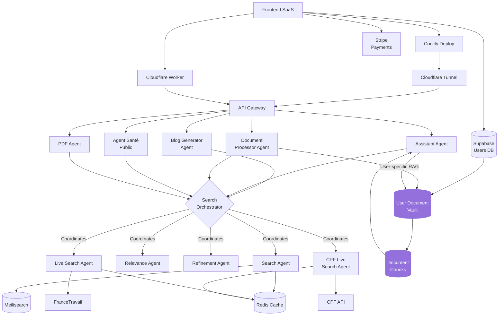
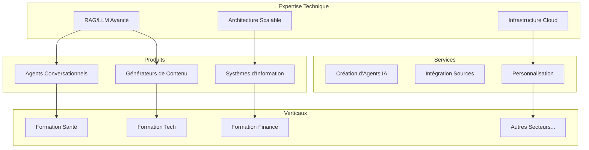
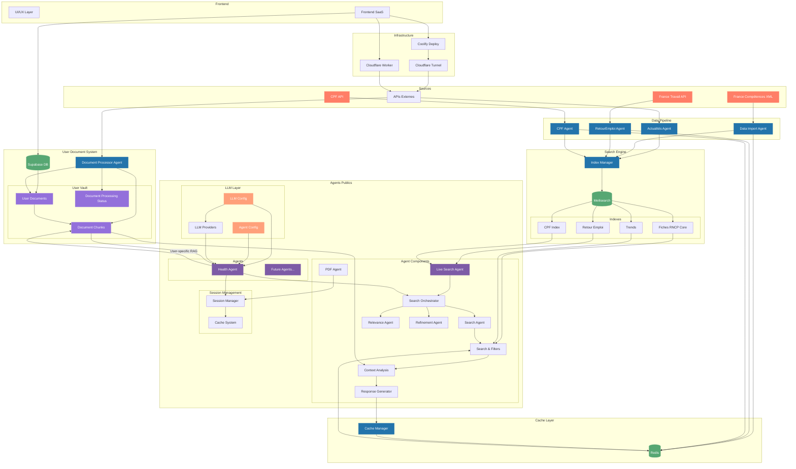
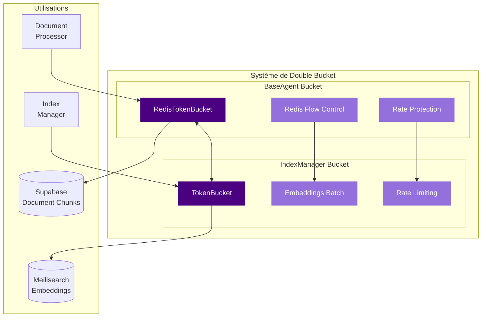

# passerelle.cc

## Architecture



## Composants

### Frontend
- **Supabase** : Gestion des utilisateurs et authentification
- **Stripe** : Gestion des paiements et abonnements

### Backend Core
- **API Gateway** : Point d'entrée unique pour les requêtes
- **Redis** : Cache pour les résultats de recherche
- **Meilisearch** : Moteur de recherche vectorielle
- **User Document Vault** : Stockage sécurisé des documents utilisateurs
- **Document Chunks** : Fragments de documents vectorisés pour le RAG utilisateur

### Agents
- **SearchOrchestrator** : Coordonne les différents agents
- **SearchAgent** : Recherche dans Meilisearch
- **RelevanceAgent** : Évalue la pertinence via RAG
- **RefinementAgent** : Affine les recherches
- **LiveSearchAgent** : Enrichit via France travail
- **CPFLiveSearchAgent** : Enrichit via CPF
- **DocumentProcessor** : Traite et indexe les documents utilisateurs pour le RAG personnalisé

### Système RAG Dual
Le système utilise désormais deux approches RAG complémentaires :
1. **RAG Global** : Basé sur les données sectorielles indexées dans Meilisearch
2. **RAG Utilisateur** : Basé sur les documents personnels de l'utilisateur stockés dans le Vault

Cette architecture permet de combiner des réponses contextuelles générales avec des informations spécifiques à l'utilisateur, offrant une expérience hautement personnalisée tout en maintenant une base de connaissances commune.

## 🎯 Moveto Studio

Moveto est un studio de solutions IA sectorielles qui combine expertise technique et connaissance métier pour créer des plateformes intelligentes spécialisées. Notre approche unique permet de déployer rapidement des solutions verticales complètes pour différents secteurs d'activité.

### Vision


### Solutions
1. **Licence Secteur**
   - Solution complète par vertical
   - Personnalisation possible
   - Support dédié
   - Déploiement cloud ou on-premise

2. **Services Pro**
   - Création d'agents personnalisés
   - Intégration de sources spécifiques
   - Formation et accompagnement
   - Conseil en stratégie IA

3. **API/SaaS**
   - IndexManager as a Service
   - Agent Factory API
   - Data Pipeline API
   - Analytics et monitoring

### Innovation
- Framework RAG++ propriétaire
- IndexManager avec support vectoriel natif
- Architecture multi-agents spécialisée
- Génération de contenu contextuelle
- Infrastructure cloud optimisée
- Système de cache intelligent

### Extensibilité 

Le système est conçu pour être facilement étendu à de nouveaux secteurs :

```python
# Exemple d'extension à un nouveau secteur
class SectorConfig:
    def __init__(self, name: str, sources: List[Source], agents: List[Agent]):
        self.name = name
        self.sources = sources  # Sources de données spécifiques au secteur
        self.agents = agents    # Agents spécialisés
        self.indexes = []       # Index Meilisearch dédiés

    async def initialize(self):
        # Configuration automatique des index
        for source in self.sources:
            index_config = await IndexManager.create_index_config(source)
            self.indexes.append(index_config)
        
        # Déploiement des agents
        for agent in self.agents:
            await agent.deploy()

# Utilisation
tech_sector = SectorConfig(
    name="Formation Tech",
    sources=[
        GitHubTrendsSource(),
        StackOverflowSource(),
        TechCertificationsSource()
    ],
    agents=[
        TechCareerAgent(),
        SkillsAnalysisAgent(),
        LearningPathAgent()
    ]
)
```

Cette architecture permet de :
- Ajouter de nouvelles sources de données
- Créer des agents spécialisés
- Configurer des index dédiés
- Personnaliser les workflows
- Adapter les modèles LLM

## 🚀 Architecture Globale



## 🔄 Système RAG Dual

Le système Passerelle.cc intègre désormais une architecture RAG (Retrieval Augmented Generation) à deux niveaux :

### 1. RAG Global (Sectoriel)
- Basé sur les données sectorielles indexées dans Meilisearch
- Alimenté par les agents d'import (Data Import, Actualités, RetourEmploi, CPF)
- Fournit une base de connaissances commune à tous les utilisateurs
- Optimisé pour les requêtes générales sur le secteur de la formation

### 2. RAG Utilisateur (Personnalisé)
- Basé sur les documents personnels stockés dans le Vault utilisateur
- Géré par le Document Processor Agent
- Stockage sécurisé dans Supabase avec isolation par utilisateur
- Permet des réponses contextualisées aux données spécifiques de l'utilisateur

### Fonctionnement
1. Les documents utilisateurs sont téléchargés via le frontend et stockés dans Supabase
2. Le Document Processor Agent traite ces documents :
   - Extraction du texte
   - Chunking (découpage en fragments)
   - Vectorisation
   - Stockage des chunks dans la table document_chunks
3. Lors d'une requête utilisateur, l'Assistant Agent :
   - Interroge le RAG global pour les connaissances sectorielles
   - Interroge simultanément le RAG utilisateur pour les informations personnalisées
   - Fusionne les résultats pour une réponse complète et contextualisée

Cette architecture permet une personnalisation poussée tout en maintenant une base de connaissances commune, offrant ainsi le meilleur des deux mondes aux utilisateurs.

## 🔒 Système de Double Bucket pour les Embeddings

Une innovation majeure de Passerelle.cc est son système de double bucket pour la gestion des embeddings, qui assure une utilisation optimale des ressources et une protection contre les limitations d'API.



### Caractéristiques du Système

1. **Double Couche de Protection**
   - `RedisTokenBucket` dans `agent_base.py` : Gère le flux Redis et la synchronisation avec Meilisearch
   - `TokenBucket` dans `index_manager.py` : Contrôle les appels d'API pour les embeddings

2. **Synchronisation Intelligente**
   - Les deux buckets communiquent pour coordonner les limites de débit
   - Adaptation dynamique aux contraintes des deux systèmes
   - Prévention des erreurs de rate limiting

3. **Optimisation des Ressources**
   - Calcul intelligent du nombre de tokens nécessaires
   - Regroupement des requêtes en lots optimaux
   - Attente adaptative basée sur la disponibilité des tokens

4. **Métriques et Monitoring**
   - Suivi en temps réel de l'utilisation des tokens
   - Statistiques détaillées sur les temps d'attente
   - Alertes en cas d'approche des limites

### Avantages

- **Fiabilité** : Prévention des erreurs de rate limiting des API externes
- **Performance** : Utilisation optimale des ressources disponibles
- **Économie** : Réduction des coûts liés aux API d'embeddings
- **Scalabilité** : Adaptation automatique aux volumes de données
- **Résilience** : Gestion gracieuse des pics de charge

Ce système est utilisé à la fois pour les embeddings dans Meilisearch (RAG global) et pour les embeddings des documents utilisateurs dans Supabase (RAG utilisateur), garantissant une cohérence et une efficacité optimales dans toute l'architecture.
