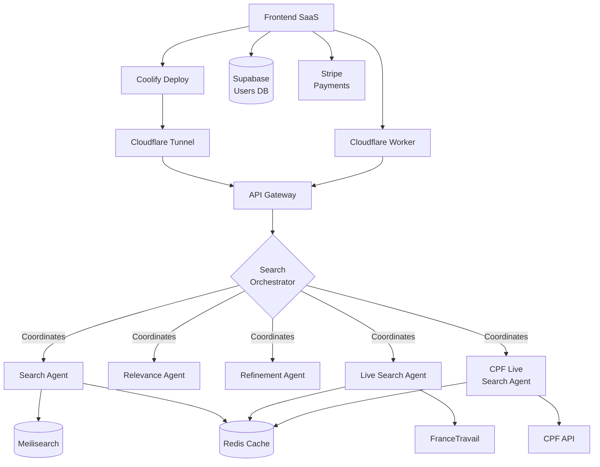

# passerelle.cc

## Architecture



## Composants

### Frontend
- **Supabase** : Gestion des utilisateurs et authentification
- **Stripe** : Gestion des paiements et abonnements

### Backend Core
- **API Gateway** : Point d'entrée unique pour les requêtes
- **Redis** : Cache pour les résultats de recherche
- **Meilisearch** : Moteur de recherche vectorielle

### Agents
- **SearchOrchestrator** : Coordonne les différents agents
- **SearchAgent** : Recherche dans Meilisearch
- **RelevanceAgent** : Évalue la pertinence via RAG
- **RefinementAgent** : Affine les recherches
- **LiveSearchAgent** : Enrichit via France travail
- **CPFLiveSearchAgent** : Enrichit via CPF

## 🎯 Moveto Studio

Moveto est un studio de solutions IA sectorielles qui combine expertise technique et connaissance métier pour créer des plateformes intelligentes spécialisées. Notre approche unique permet de déployer rapidement des solutions verticales complètes pour différents secteurs d'activité.

### Vision

```mermaid
graph TB
    subgraph "Expertise Technique"
        RAG[RAG/LLM Avancé]
        ARCH[Architecture Scalable]
        INFRA[Infrastructure Cloud]
    end

    subgraph "Produits"
        CHAT[Agents Conversationnels]
        GEN[Générateurs de Contenu]
        INFO[Systèmes d'Information]
    end

    subgraph "Services"
        AGENT[Création d'Agents IA]
        SRC[Intégration Sources]
        PERSO[Personnalisation]
    end

    subgraph "Verticaux"
        SANTE[Formation Santé]
        TECH[Formation Tech]
        FIN[Formation Finance]
        FUTUR[Autres Secteurs...]
    end

    RAG --> CHAT
    RAG --> GEN
    ARCH --> INFO
    INFRA --> PERSO
    
    CHAT --> SANTE
    GEN --> TECH
    INFO --> FIN
    PERSO --> FUTUR
```


### Solutions
1. **Licence Secteur**
   - Solution complète par vertical
   - Personnalisation possible
   - Support dédié
   - Déploiement cloud ou on-premise

2. **Services Pro**
   - Création d'agents personnalisés
   - Intégration de sources spécifiques
   - Formation et accompagnement
   - Conseil en stratégie IA

3. **API/SaaS**
   - IndexManager as a Service
   - Agent Factory API
   - Data Pipeline API
   - Analytics et monitoring

### Innovation
- Framework RAG++ propriétaire
- IndexManager avec support vectoriel natif
- Architecture multi-agents spécialisée
- Génération de contenu contextuelle
- Infrastructure cloud optimisée
- Système de cache intelligent

### Extensibilité 

Le système est conçu pour être facilement étendu à de nouveaux secteurs :

```python
# Exemple d'extension à un nouveau secteur
class SectorConfig:
    def __init__(self, name: str, sources: List[Source], agents: List[Agent]):
        self.name = name
        self.sources = sources  # Sources de données spécifiques au secteur
        self.agents = agents    # Agents spécialisés
        self.indexes = []       # Index Meilisearch dédiés

    async def initialize(self):
        # Configuration automatique des index
        for source in self.sources:
            index_config = await IndexManager.create_index_config(source)
            self.indexes.append(index_config)
        
        # Déploiement des agents
        for agent in self.agents:
            await agent.deploy()

# Utilisation
tech_sector = SectorConfig(
    name="Formation Tech",
    sources=[
        GitHubTrendsSource(),
        StackOverflowSource(),
        TechCertificationsSource()
    ],
    agents=[
        TechCareerAgent(),
        SkillsAnalysisAgent(),
        LearningPathAgent()
    ]
)
```

Cette architecture permet de :
- Ajouter de nouvelles sources de données
- Créer des agents spécialisés
- Configurer des index dédiés
- Personnaliser les workflows
- Adapter les modèles LLM

## 🚀 Architecture Globale

```mermaid
graph TB
    subgraph "Infrastructure"
        CFT[Cloudflare Tunnel]
        CFW[Cloudflare Worker]
        COOL[Coolify Deploy]
    end

    subgraph "Frontend"
        UI[UI/UX Layer]
        FRONT[Frontend SaaS]
    end

    subgraph Sources
        API[APIs Externes]
        FC[France Compétences XML]
        FT[France Travail API]
        CPF[CPF API]
    end

    subgraph "Data Pipeline"
        AA[Actualités Agent]
        DA[Data Import Agent]
        REA[RetourEmploi Agent]
        CPFA[CPF Agent]
    end

    subgraph "Search Engine"
        INDM[Index Manager]
        ME[(Meilisearch)]
        subgraph "Indexes"
            RNCP[Fiches RNCP Core]
            TRENDS[Trends]
            REMP[Retour Emploi]
            CPFI[CPF Index]
        end
    end

    subgraph "Cache Layer"
        RE[(Redis)]
        CM[Cache Manager]
    end

    subgraph "Agents Publics"
        subgraph "Agent Components"
            SF[Search & Filters]
            CA[Context Analysis]
            RG[Response Generator]
            SO[Search Orchestrator]
            SA[Search Agent]
            RA[Relevance Agent]
            RF[Refinement Agent]
            LSA[Live Search Agent]
            PDF[PDF Agent]
        end
        subgraph "LLM Layer"
            LC[LLM Config]
            AC[Agent Config]
            PROV[LLM Providers]
        end
        subgraph "Agents"
            HA[Health Agent]
            FA[Future Agents...]
        end
        subgraph "Session Management"
            SM[Session Manager]
            CACHE[Cache System]
        end
    end

    %% Infrastructure Connections
    FRONT --> COOL
    COOL --> CFT
    FRONT --> CFW
    CFT --> API
    CFW --> API

    %% Flux de données
    API --> AA
    FC --> DA
    FT --> REA
    CPF --> CPFA
    
    AA --> INDM
    DA --> INDM
    REA --> INDM
    CPFA --> INDM
    
    DA --> RE
    REA --> RE
    CPFA --> RE
    
    INDM --> ME
    ME --> RNCP
    ME --> TRENDS
    ME --> REMP
    ME --> CPFI
    
    RNCP --> SF
    TRENDS --> SF
    REMP --> LSA
    CPFI --> LSA
    
    SF --> CA
    CA --> RG
    LSA --> SO
    
    LC --> HA
    AC --> HA
    
    RE --> SF
    RG --> CM
    CM --> RE

    %% Nouveaux flux
    SO --> SA
    SO --> RA
    SO --> RF
    SA --> SF
    HA --> SO
    HA --> SM
    SM --> CACHE
    LC --> PROV
    PROV --> HA
    PDF --> SM

    %% Styles
    classDef primary fill:#2374ab,stroke:#2374ab,color:#fff
    classDef secondary fill:#ff7e67,stroke:#ff7e67,color:#fff
    classDef storage fill:#57a773,stroke:#57a773,color:#fff
    classDef agent fill:#7d5ba6,stroke:#7d5ba6,color:#fff
    classDef llm fill:#ffa07a,stroke:#ffa07a,color:#fff
    
    class FC,FT,CPF secondary
    class ME,RE storage
    class HA,FA,LSA agent
    class DA,AA,REA,CPFA,INDM,CM primary
    class LC,AC llm
```


